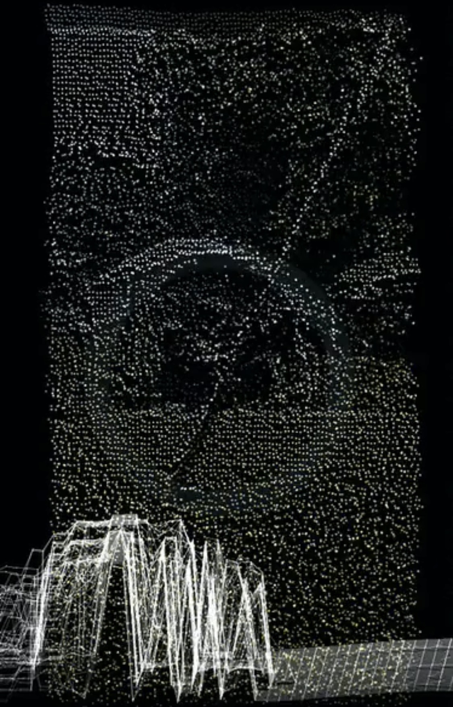
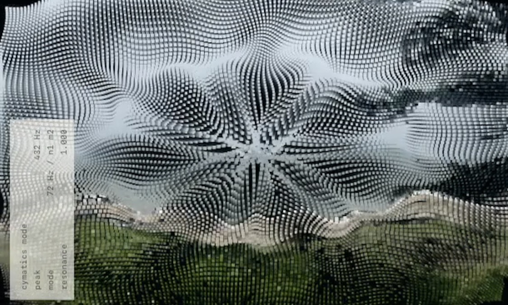
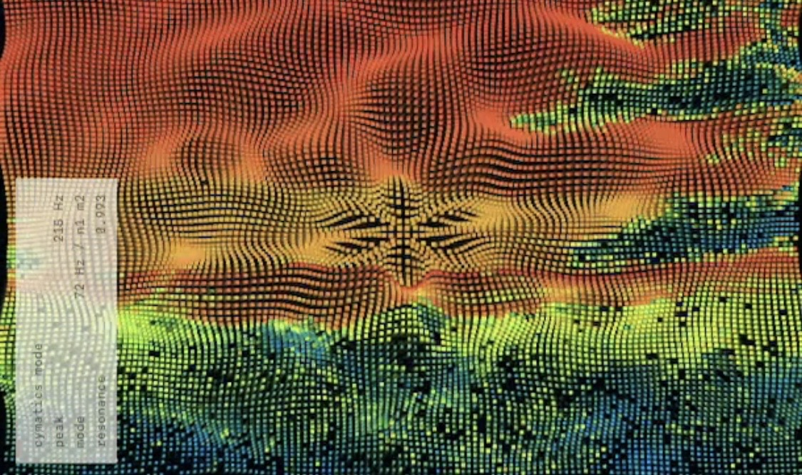

# Sound Scanner

[English](README.md) | [日本語](README.ja.md)

[ライブデモ](https://sound-scanner-nine.vercel.app/)

Sound Scannerは、スマートフォンのライブカメラ映像とマイク入力を使い、周囲の光・形・音の変化を、点群、走査線、輪郭、残像、ノイズ、波紋状のパターンとして可視化する、モバイルWeb向けの実験的フィールド・ビジュアライザーです。

このアプリは、現実空間を正確に測定するためのスキャナーではありません。目指しているのは、自然音、野外農業環境、里山、畑、林、風、水、虫、鳥、作業音、機械音など、普段は背景として流れてしまう環境の動きを、あらためて観察できるものとして扱うことです。

マイク入力は、Web Audio APIのAnalyserNodeを通してFFT、つまり高速フーリエ変換にもとづく周波数データとして解析されます。音量、周波数帯域、ピーク周波数、スペクトル重心、スペクトルフラックスなどの値を使い、点群の奥行きと揺れ、点の大きさと明るさ、走査速度、ノイズや輪郭の変化、残像、ショックウェーブ、粒子運動を変化させます。

カメラ映像からは、明るさ、色、彩度、局所的なエッジ、フレーム間の動きを取得し、それらを音響解析の値と組み合わせて、奥行きや地形のように見える視覚表現を生成します。

Sound Scannerは、実際のLiDAR、ソナー、校正済み周波数計、環境計測器ではありません。iPhone LiDAR、ARKit、WebXR Depth Sensing、クラウド画像認識サービスも使用していません。ここで生成される奥行き、周波数表示、波紋状のパターンは、端末上で処理された映像と音声にもとづく擬似的な可視化です。

Cymatic Plateモードは、サイマティクスやクラドニ図形から着想した粒子表現です。ただし、振動板の物理シミュレーションではありません。材質、境界条件、加振位置、校正された共振周波数はモデル化せず、FFT解析で得られた音の変化を、節線、波紋、円環、揺らぎ、粒子運動のような視覚パターンへ変換します。

Sound Scannerが目指しているのは、音を正確な数値として測ることではなく、音・光・形・動きの関係をリアルタイムに可視化し、実験的なフィールドレコーディングや環境観察の手がかりにすることです。

## 機能

- iPhone Safariを主対象とした静的Webアプリ
- `MediaDevices.getUserMedia`による背面カメラ映像の取得
- Web Audio APIの`AnalyserNode`を使ったマイク音声解析
- FFT解析にもとづく音量、周波数帯域、ピーク周波数、スペクトル重心、スペクトルフラックスの取得
- Three.jsの`BufferGeometry`による点群描画
- Point Cloud、Frequency Scan、Line Scan、Cymatic Plateの4モード
- `POINT` / `FREQ` / `LINE` / `CYMATIC`ボタンによる直接選択
- タッチスワイプによるエフェクト強度と点密度の調整
- 対応ブラウザで、マイク音声を任意に含められるアプリ内録画
- サーバー処理、ログイン、データベース、メディアアップロードなし

## このアプリについて

Sound Scannerは、カメラフィルター、正確な空間スキャナー、音響測定器のどれか一つに分類されるものではありません。

点群や走査線は、ライブカメラ映像をもとに生成されます。そこにマイク入力の解析結果が重なり、低域の押し出し、中域の揺れ、高域の細かなノイズ、ピーク時の衝撃波、スペクトル重心による色調変化、スペクトルフラックスによる不安定さが加わります。

疑似的な奥行きは、端末上で次の情報から生成されます。

- カメラ映像の明るさ
- 色の彩度
- 局所的なエッジコントラスト
- フレーム間の動き
- マイク入力の音量
- 周波数帯域ごとの強さ
- ピーク周波数
- スペクトル重心
- スペクトルフラックス

目指しているのは、暗い背景、点群、走査線、輪郭、残像、ノイズ、地形のような奥行きを備えた、音響反応型のフィールドレコーディング・ビジュアライザーです。野外の音や動きに対して、普段の視覚や聴覚だけでは流れてしまう変化を、別のかたちで観察するための道具として設計しています。

入口画面の粒状ビジュアルは静的画像ではなく、`src/entrance-grain.js`がcanvas上でリアルタイム生成しています。このリポジトリに含まれる静的画像は、プロジェクトで所有する`assets/icons/favicon.png`だけです。

## 依存関係ポリシー

このプロジェクトは、リポジトリの依存関係安全ポリシーに従います。

- Node.jsプロジェクトでは`pnpm`を使用します。
- 新しいパッケージリリースは`minimumReleaseAge: 4320`により3日間保留します。
- 依存関係を変更する作業は、特に既存の`npm`プロジェクトでは慎重に扱います。

## セットアップ

Node.js 20.19以降とpnpm 10が必要です。

```bash
pnpm install
pnpm dev
```

表示されたViteのローカルURLを開きます。

静的アプリをビルドするには：

```bash
pnpm build
```

本番ビルドをプレビューするには：

```bash
pnpm preview
```

## ライブデモ

公開アプリ：

https://sound-scanner-nine.vercel.app/

この公開ソースリポジトリは、本番Vercelプロジェクトには接続されていません。

iPhoneでのテストにはHTTPSのURLを使用してください。安全でないURLでは、カメラとマイクの権限が正常に動作しないことがあります。

## iPhone実機テスト

カメラとマイクの権限にはセキュアコンテキストが必要です。

推奨する方法：

1. HTTPSのプレビューデプロイを使用する。
2. Mac上のVite開発サーバーへローカルHTTPSトンネルを使用する。
3. 同一ネットワークでは`pnpm dev`で開発サーバーを公開し、MacのLANアドレスをiPhoneから開く。ただしHTTPS以外では権限の挙動が変わるため、HTTPSを推奨します。

iPhoneでの手順：

1. Safariでアプリを開く。
2. `Start`をタップする。
3. カメラへのアクセスを許可する。
4. マイクへのアクセスを許可する。
5. 背面カメラを照明、人、風景などへ向け、近くで音を鳴らす。

権限が使えない場合：

- ページがHTTPSであることを確認する。
- SafariのWebサイト設定でカメラとマイクの権限を確認する。
- 権限変更後にページを再読み込みする。
- 他のアプリがカメラやマイクを使用している場合は終了して再試行する。
- マイク権限が利用できない場合も、カメラ点群は控えめなフォールバック動作で表示できます。

## 操作

- モード選択：`POINT`、`FREQ`、`LINE`、`CYMATIC`をタップまたはクリック
- タッチで上下スワイプ：エフェクト強度を上げる／下げる
- タッチで左右スワイプ：点密度を下げる／上げる
- デバッグパネル：キーボードの`D`、または左上隅を素早く4回タップ

デスクトップのキーボード操作：

- 上下矢印：エフェクト強度
- 左右矢印：点密度／品質
- `D`：デバッグパネル

点密度プリセット：

- モバイル縦向き：64 x 96 / 96 x 128 / 112 x 160
- モバイル横向き：96 x 64 / 128 x 96 / 160 x 112
- デスクトップ横向き：128 x 96 / 160 x 120 / 192 x 144

iPhone SafariではMIDを推奨します。

標準のMIDプリセットでは、カメラ映像由来の12,288点を描画します。

## モード

### Point Cloud

標準モードです。ライブカメラのRGBを主な視覚情報として保ちながら、各サンプル画素を3D空間の点へ変換します。明るさ、彩度、エッジコントラスト、フレーム間の動き、低域エネルギーから疑似的な奥行き空間を生成します。

### Frequency Scan

<p align="center">
  
</p>

音響解析を前面に出した、音楽環境向けのスキャンモードです。カメラ点群を維持しながら、次のように音の解析結果を強く反映します。

- 低域が点群を手前へ押し出し、重いパルスを作る
- 中域が点群を横方向へ曲げ、波の干渉を加える
- 高域が走査線、点の大きさ、揺らぎを鋭くする
- ピークや立ち上がりが、抑制された衝撃波状の帯と残像を作る
- スペクトル重心が色調を暖色または寒色へ変える
- スペクトルフラックスが走査速度と不安定さを変える
- 圧縮された周波数帯域が空間内のスペクトラムリボンへ反映される
- 周波数履歴が軽量なウォーターフォール／スペクトログラム層として描画される
- 強いピークが小さく減衰する周波数ショックウェーブを発生させる

目的は棒グラフ式のスペクトラム表示ではありません。周波数分布を波、パルス、空間層としてスキャン空間へ埋め込みます。

Frequency Scanでは、左側に小さなFrequency Monitorも表示されます。

- `ピーク`：現在もっとも強い周波数ビンをHzへ変換した値
- `重心`：周波数とエネルギーの加重平均で求めたスペクトル重心
- `変動`：現在と直前の周波数フレームの差から求めたスペクトルフラックス
- `低域`：20–250 Hzのエネルギー
- `中域`：250–4000 Hzのエネルギー
- `高域`：4000–12000 Hzのエネルギー

ピーク値は、音源の周波数を正確に断定するものではありません。スマートフォンのマイク、自動ゲイン、会場の反射、風、音源との距離、クリッピングによって値は変動します。精密測定器ではなく、観察記録と視覚表現のための目安として扱ってください。

### Line Scan

輪郭観察モードです。サンプリングしたカメラフレームから輝度と軽量なSobel風エッジマップを計算し、淡い背景に暗い線として描画します。ポスタライズした輝度から等高線のような構造も加えます。

- 低域が線を太くし、前方へ押し出す
- 中域が描画を穏やかに歪ませる
- 高域が細かな線ノイズとディテールを加える
- デスクトップや横長画面では、観察図のように広く平坦なレイアウトになる
- ピーク時に輪郭の濃さと量が一時的に増える

カメラフィルターというより、スケッチ、地図、フィールド観察図のように見えることを意図しています。

### Cymatic Plate

<p align="center">
  
  
</p>

サイマティクスとクラドニ図形に着想を得た粒子フィールドモードです。FFT由来の周波数エネルギーが数学的な節線パターンを選択・励起し、低域、中域、高域、ピーク、スペクトル重心が粒子運動とパターン遷移へ影響します。

これは振動板の物理シミュレーションではなく、リアルタイムの表現モデルです。材質、境界条件、加振位置、校正された共振周波数はモデル化していません。

## 録画

HUDの`REC`を押すと、現在の視覚出力を録画できます。終了するには`STOP REC`を押します。

- 生のカメラ映像ではなく、描画済みのビジュアルcanvasを録画します。
- マイク権限が有効な場合は、マイク音声トラックを録画へ追加します。
- H.264/AACのWebCodecsが利用できる場合、30 fpsの明示的なタイムスタンプを持つ非フラグメントMP4を生成します。
- 必要なWebCodecsエンコーダーがないブラウザでは`MediaRecorder`へフォールバックします。この形式は一部の編集ソフトやプラットフォーム向けに変換が必要な場合があります。
- 対応するiPhoneブラウザでは、共有シートから動画を保存できます。
- デスクトップでは録画ファイルをダウンロードします。
- 特定のiPhone／iOSでアプリ内録画が不安定な場合は、コントロールセンターの画面収録を使用してください。
- 録画処理は端末内で行われます。カメラ、マイク、録画データはこのプロジェクトからアップロードされません。

## 既知の制約

- 実際のiPhone LiDARデータは使用しません。
- WebXR Depth Sensingは実装していません。
- 点群は、低解像度のカメラサンプリング、明るさ、色、音声解析から生成されます。
- iOS Safariでは、カメラ、マイク、AudioContextの開始前にユーザー操作が必要です。
- デスクトップに`facingMode: environment`がない場合、標準Webカメラへフォールバックします。
- 高い点密度は、古いiPhoneの発熱とバッテリー消費を増やす場合があります。
- アプリ内録画は、互換性のあるH.264/AACエンコーダーがある場合はWebCodecsを使い、それ以外では`MediaRecorder`を使うため、対応状況と長時間録画の安定性はiOS／Safariのバージョンによって異なります。
- MP4録画はメモリ上の出力バッファを使用するため、非常に長い録画ではモバイル端末のメモリを多く消費する可能性があります。
- カメラとマイクのデータはアップロードしません。
- MVPには、ログイン、データベース、サーバー処理、クラウドストレージ、SNS投稿、MIDI、NDI、TouchDesigner連携はありません。

## コントリビューション

開発方法と実機テスト要件は[CONTRIBUTING.md](CONTRIBUTING.md)を参照してください。

セキュリティ上の問題は[SECURITY.md](SECURITY.md)の手順で報告してください。

ランタイム依存関係のライセンス情報は[THIRD_PARTY_NOTICES.md](THIRD_PARTY_NOTICES.md)に記載しています。

## ライセンス

Sound Scannerは[MIT License](LICENSE)で公開します。

第三者ライブラリには、それぞれのライセンスが適用されます。[THIRD_PARTY_NOTICES.md](THIRD_PARTY_NOTICES.md)を参照してください。
